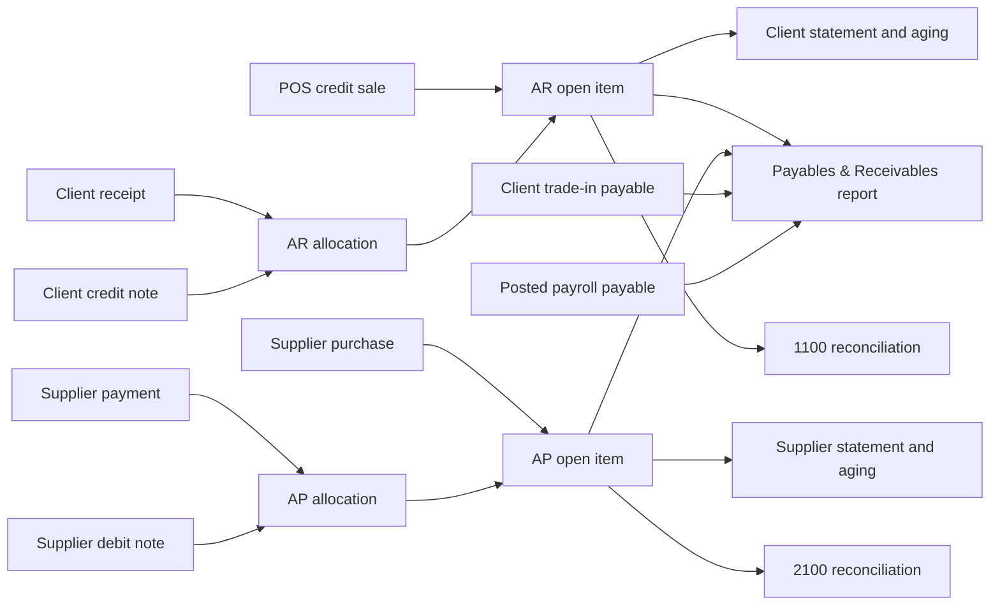

# ValueInSoft Credit, Open Items, Payables and Receivables Handbook

**Version:** implementation snapshot dated 2026-07-12  
**Audience:** owners, accountants, branch managers, support staff, developers, QA, and operations  
**Scope:** AR/AP open items, credit control, receipts and allocations, notes, reversals, reconciliation, opening balances, monitoring, frontend workflows, and the Payables & Receivables report

---

## 1. Purpose

This handbook explains how the ValueInSoft credit and obligations system works from both a business and technical perspective.

It answers four core questions:

1. Which clients should pay the company?
2. Which suppliers, trade-in clients, or employees should the company pay?
3. Which source document created each balance, and which receipt or adjustment settled it?
4. How can an incorrect financial action be reversed without deleting audit history?

The system uses the open-item method. Every unpaid credit sale or supplier purchase becomes a separate document with an original amount, a settled amount, and a remaining amount.

---

## 2. Quick start for business users

### See who owes the company

1. Open the main aside navigation.
2. Expand **Reports**.
3. Select **Payables & Receivables**.
4. Select **Should pay us**.
5. Choose the as-of date and search by client name, phone, order, or receipt.
6. Select **Details** to see credit orders, order lines, due dates, balances, and applied receipts or credit notes.

### See who the company should pay

1. Open **Reports → Payables & Receivables**.
2. Select **We should pay**.
3. Review unpaid supplier purchases, client trade-in payouts, and posted unpaid employee payroll.
4. Select **Details** to see source documents, item/payroll lines, payments, notes, and remaining balances.

### Receive money from a client

1. Open the client receipt flow.
2. Enter a positive payment amount.
3. Save the receipt.
4. Use FIFO allocation or select exact documents manually.
5. Any unallocated amount remains on account for later use.

### Pay a supplier

1. Record a supplier payment.
2. The server reads the authoritative purchase balance.
3. It allocates the payment to the oldest due documents first.
4. The client-supplied `remainingAmount` is ignored; the server calculates it.

---

## 3. Terminology

| Term | Meaning |
|---|---|
| AR | Accounts receivable: money clients owe the company. |
| AP | Accounts payable: money the company owes suppliers. |
| Open item | An unpaid or partially paid document tracked separately. |
| Allocation | A receipt, payment, credit note, or debit note applied to an open item. |
| FIFO | Automatic allocation to the oldest due document, then oldest document date. |
| Remaining amount | The part of a document that is still unpaid. |
| Settled amount | The part already paid or offset. |
| Credit note | An offset document that reduces client receivables. |
| Debit note | An offset document that reduces supplier payables. |
| Reversal | A compensating transaction that preserves the original history. |
| Exposure | Open client receivables minus unapplied client credit notes. |
| Aging | Outstanding balances grouped by how long they are overdue. |
| Control account | General-ledger account representing total AR or AP. |
| Reconciliation drift | Difference between the open-item subledger and attributable GL balance. |

---

## 4. Business model

### 4.1 Client receivables

A credit POS sale creates an AR open item:

```text
Credit POS order
  → AR open item
  → client receipt or credit note allocation
  → partially settled or settled
```

The document records company, branch, client, order source, reference, document date, due date, currency, totals, status, and audit metadata.

### 4.2 Supplier payables

A non-trade-in supplier purchase with an unpaid balance creates an AP open item:

```text
Supplier purchase receipt
  → AP open item
  → supplier payment or debit note allocation
  → partially settled or settled
```

Supplier identity is branch-specific. The authoritative party key is `(branch_id, supplier_id)`.

### 4.3 Other company payables

The unified obligations report also reads:

- client trade-in receipts with a remaining payout;
- posted or partially-paid payroll lines with employee remaining amounts.

Draft payroll is excluded. Salary rows require `payroll.payment.read`.

### 4.4 Currency

Balances are never combined across currencies. Allocation is rejected when source and document currencies differ.

---

## 5. Architecture overview



### Technology

- Backend: Spring Boot, Java 21, Spring JDBC, transactional services.
- Database: PostgreSQL with per-company schemas such as `c_7`.
- Database changes: Flyway only.
- Frontend: React, React Query, React Bootstrap, React Intl.
- Metrics: Actuator, Micrometer, Prometheus.

---

## 6. Database implementation

### 6.1 Flyway migrations

| Migration | Responsibility |
|---|---|
| `V141__ar_open_items_foundation.sql` | AR open items, allocations, constraints, indexes, and triggers. |
| `V142__ap_open_items_and_supplier_terms.sql` | AP foundation and supplier payment terms. |
| `V143__receipt_hardening.sql` | Receipt status, reversal reference, idempotency, and payment method. |
| `V144__credit_debit_notes.sql` | Credit/debit notes and note-backed allocations. |
| `V145__ar_ap_open_items_capabilities.sql` | Open-item and note permissions. |
| `V146__pos_credit_control_mode_setting.sql` | Branch OFF/WARN/BLOCK credit mode. |
| `V147__openitems_opening_import_audit.sql` | Append-only opening-import audit. |

New-company provisioning calls the same tenant ensure functions used by migrations. New-branch provisioning includes supplier payment terms.

### 6.2 Main tables

AR:

- `ar_open_item`
- `ar_receipt_allocation`
- `ar_credit_note`
- hardened legacy `"ClientReceipts"`

AP:

- `ap_open_item`
- `ap_payment_allocation`
- `ap_debit_note`
- hardened legacy `"supplierReciepts"`

Related payable sources:

- `client_tradein_receipt`, `client_tradein_payment`, `client_tradein_payment_allocation`
- `payroll_run`, `payroll_run_line`, `payroll_payment`, `payroll_payment_line`

### 6.3 Money and status invariants

All new money columns use `NUMERIC(19,4)`.

```text
settled_amount + remaining_amount = total_amount
```

Open-item statuses:

- `OPEN`
- `PARTIALLY_SETTLED`
- `SETTLED`
- `REVERSED`

Note statuses:

- `OPEN`
- `PARTIALLY_APPLIED`
- `APPLIED`
- `REVERSED`

### 6.4 Append-only history

Allocation rows are never deleted. Corrections insert reversal rows referencing the original. Guard triggers reject prohibited deletes and mutations.

No `ON DELETE CASCADE` is used on the new open-item financial tables.

### 6.5 Historical data

There is no automatic historical backfill migration. Historical balances may enter only through the gated opening-balance workflow.

---

## 7. Payment classification

`PaymentTypeClassifier` is the single authority for payment normalization:

- `CASH`
- `CARD`
- `WALLET`
- `RECEIVABLE`
- `OTHER(raw)`

It is shared by POS posting, credit-sale creation, daily cash closing, and reconciliation staging. New code must not use free-text substring inference.

---

## 8. Open-item creation

### 8.1 POS credit sale

The POS checkout gives the cashier three choices: **pay in full now**, **partial now, balance later**, and **pay later**.

1. For a partial or pay-later sale, select a client. Supplier-as-customer credit sales require the dedicated supplier receivable implementation; do not record them as supplier purchases.
2. The POS validates a partial amount is greater than zero and less than the net total.
3. Send the sale as `RECEIVABLE` when a balance remains; full payment stays a direct cash sale.
4. Run credit control only for the amount remaining after the cash collected now.
5. Insert the POS order and create one AR item for the full sale amount in the same transaction.
6. When cash was collected now, create a posted client receipt and append-only allocation against that same new open item.
7. The item therefore shows the original document total, settled amount, remaining amount, and `PARTIALLY_SETTLED` or `OPEN` status in **Should pay us**.
8. Set due date from client terms and keep the sale/receipt GL postings auditable.

An order cannot commit without its required open item.

### 8.1.1 Selling to a supplier as a customer

The POS **Supplier sale** tab treats the selected supplier as a buyer, not as an AP vendor transaction.

1. Select a branch supplier. Its identity is stored in AR as `party_type=SUPPLIER` and `supplier_id`; a client ID is never synthesized or reused.
2. Each cart line defaults to the recorded buying price plus 5%. The cashier may adjust each sale price before checkout.
3. Full, partial, and pay-later choices behave like client sales. A remaining balance creates `POS_SUPPLIER_ORDER` in `ar_open_item`.
4. Cash received during a partial checkout creates `ar_supplier_receipt` and `ar_supplier_receipt_allocation` audit rows and a `CASH_SALE` shift movement.
5. Supplier receivables appear under **Should pay us**, including their order lines and receipt applications. AP purchases remain under **We should pay them**.
6. The supplier profile has a **Should pay us** tab showing its open sales, received amount, and remaining balance. **Receive & allocate** records a later payment and applies it FIFO to the supplier's oldest open sales.

The schema extension is installed only by Flyway migration `V148__supplier_receivables.sql` and is also applied during future tenant provisioning.

### 8.2 Supplier purchase

1. Create the inventory stock-ledger receipt.
2. Exclude trade-in receipts from supplier AP.
3. When remaining amount is positive, create one AP open item.
4. Set due date from supplier terms.
5. Source uniqueness prevents duplicates during replay.

### 8.3 Idempotency

Document and allocation paths use stable caller keys or deterministic derived keys. A replay returns the existing result rather than duplicating money rows.

---

## 9. Allocation engine

### 9.1 Transaction protocol

1. Lock the receipt or note with `FOR UPDATE`.
2. Validate status and available amount.
3. Lock target items in ascending `open_item_id` order.
4. Validate tenant, branch, party, currency, status, and remaining capacity.
5. Detect idempotent replay.
6. Insert append-only allocations.
7. Recompute settled, remaining, status, and version.
8. Update note applied/unapplied totals when applicable.
9. Commit together.

Ordered locking reduces deadlock risk; database triggers provide a second integrity layer.

### 9.2 FIFO

When no explicit list is sent, allocation order is:

1. due date, nulls last;
2. document date;
3. open-item id.

### 9.3 Manual allocation

```json
{
  "currencyCode": "EGP",
  "idempotencyKey": "receipt-902-allocation-v1",
  "allocations": [
    { "openItemId": 123, "amount": 50.0000 },
    { "openItemId": 124, "amount": 25.0000 }
  ]
}
```

The server rejects duplicate targets, non-positive amounts, over-allocation, mismatch, or unavailable documents.

If a receipt exceeds selected/open documents, its remainder stays on account.

---

## 10. Receipts and payouts

### Client receipts

- New amounts must be positive.
- Empty allocation list means server FIFO.
- `type: "ClientPayout"` represents money paid to a client and still uses a positive amount.
- Historical negative rows remain readable; new negative rows are rejected.

### Supplier payments

- The server calculates remaining amounts.
- Client-provided `remainingAmount` is ignored and logged.
- Legacy writes are derived from server-side math.
- Compatibility is controlled by:

```properties
finance.openitems.legacy-writes.enabled=true
```

Keep it enabled until all legacy supplier reads are retired.

---

## 11. Credit and debit notes

Notes are offset documents, not negative open items.

- Client credit note: reduces AR.
- Supplier debit note: reduces AP.
- Application uses the allocation engine and does not post another GL movement.
- Applied allocations must be reversed before reversing the note.

Example:

```json
{
  "branchId": 3,
  "partyId": 11,
  "reason": "Returned damaged item",
  "referenceType": "POS_RETURN",
  "referenceId": 8801,
  "currencyCode": "EGP",
  "totalAmount": 120.0000,
  "idempotencyKey": "credit-note-return-8801",
  "notes": "Approved by branch manager"
}
```

---

## 12. Reversals

### Allocation reversal

- inserts a mirror allocation;
- links it to the original;
- marks the original reversed;
- restores item remaining;
- restores note unapplied amount where applicable.

### Receipt reversal

A receipt cannot be reversed with active allocations. Reverse them first.

If a posted GL journal exists, `payment/subledger_reversal` mirrors every journal line and marks the original journal reversed. If no posting exists, reversal is subledger-only. Pending/failed original posting requests cause a conflict.

### Open-item reversal

An item cannot be reversed while settled. Reverse allocations first.

### Returns

- cash sale return → cash refund behavior;
- credit sale return → credit note/reduction behavior.

This prevents refunding cash that was never received.

---

## 13. Client credit control

Client settings:

- credit limit;
- terms in days;
- `NORMAL`, `HOLD`, or `BLOCKED`;
- internal notes.

Exposure:

```text
open AR remaining across the company
- unapplied client credit notes
```

Branch mode:

| Mode | Behavior |
|---|---|
| `OFF` | Skip limit check. |
| `WARN` | Allow limit breach with warning. |
| `BLOCK` | Reject limit breach. |

The client row is locked before exposure calculation, so concurrent sales cannot both consume the same credit headroom.

Common codes:

- `CREDIT_SALE_CLIENT_REQUIRED`
- `CREDIT_CLIENT_NOT_FOUND`
- `CREDIT_CLIENT_ON_HOLD`
- `CREDIT_CLIENT_BLOCKED`
- `CREDIT_LIMIT_EXCEEDED`

---

## 14. Reconciliation and opening balances

Control accounts:

- AR: `1100`
- AP: `2100`

```text
variance = subledger total - attributable control balance
```

Platform billing entries using 1100 without a client are excluded by source type.

### Staging

AR staging flags bounce-backs, negative historical receipts, and receipts exceeding inferred credit orders.

AP staging identifies unexplained purchase/payment history and drift between stock-ledger remaining and legacy supplier totals.

### Opening import

1. Calculate prospective variance without item writes.
2. Invalid result → record `ABORTED`, insert nothing.
3. Valid result → insert deterministic opening items.
4. Recheck inside the same transaction.
5. Concurrent drift → rollback and retry.
6. Record the final audit row.

Dry run inserts no open items.

```json
{
  "side": "AR",
  "lines": [
    { "branchId": 3, "partyId": 11, "amount": 500.0000 }
  ],
  "approvedVariance": null,
  "approver": null,
  "dryRun": true,
  "notes": "Pre-go-live validation"
}
```

Approved variance requires an approver and is logged at WARN.

---

## 15. Statements and aging

Client account UI includes credit settings, exposure, open items, aging, statement, and receipt allocation.

Supplier UI includes open documents, due-date aging, statement data, and server FIFO payment allocation.

Statements default to 90 days.

Aging uses due date:

- current;
- 1–30;
- 31–60;
- 61–90;
- over 90 days.

---

## 16. Payables & Receivables report

### Navigation

The aside has a dedicated **Reports** section:

- **Payables & Receivables**
- **Financial reports**

### Should pay us

Shows client AR by party and currency with contact, document count, overdue count, oldest due date, remaining amount, and overdue amount.

### We should pay

Shows:

- suppliers from AP;
- clients with unpaid trade-in receipts;
- employees with posted unpaid payroll.

Employee rows require both `finance.report.read` and `payroll.payment.read`. Users without payroll permission still see suppliers and trade-in clients.

### Detail modal

Details load only when opened and include:

- source type/reference/date;
- payment method and actor;
- total, settled, remaining, and due state;
- overdue days;
- order/purchase/trade-in/payroll lines;
- item, quantity, unit amount, and total;
- receipts, payouts, notes, applications, and reversals.

### Filters

- explicit server-enforced branch;
- as-of date;
- debounced name/contact/document search;
- default 50, maximum 200 rows;
- separate currencies.

---

## 17. Frontend workflows and limitations

### Client Account & Credit

Users with `clients.credit.manage` can edit limit, terms, status, and notes. Other authorized users see exposure and availability.

### Receipt allocation modal

The UI previews FIFO. Leaving it unchanged sends an empty list so the server performs authoritative FIFO. Editing a row sends explicit targets. Remainder is shown as on-account money.

### Supplier open items

Supplier details include open documents and aging. Supplier payments allocate FIFO server-side.

Current gap: the legacy supplier payment form does not yet offer manual multi-document override.

### POS

The payment panel supports full cash payment, partial cash payment with a client balance, and pay-later. Partial and pay-later modes require a selected client and are saved online only, so the open item and its receipt allocation are recorded atomically. Offline queueing remains available only for fully paid sales.

The printed 80mm, A5, and A4 receipts show the payment status, amount collected now, and balance due later. The customer name is shown for credit sales.

---

## 18. API reference

### Client reads

| Method | Endpoint |
|---|---|
| GET | `/clientAccount/{companyId}/{clientId}/open-items?branchId=...` |
| GET | `/clientAccount/{companyId}/{clientId}/statement?branchId=...` |
| GET | `/clientAccount/{companyId}/{clientId}/aging?branchId=...` |
| GET | `/clientAccount/{companyId}/{clientId}/credit?branchId=...` |
| PUT | `/clientAccount/{companyId}/{clientId}/credit?branchId=...` |

### Supplier reads

| Method | Endpoint |
|---|---|
| GET | `/suppliers/{companyId}/{branchId}/{supplierId}/open-items` |
| GET | `/suppliers/{companyId}/{branchId}/{supplierId}/open-items/statement` |
| GET | `/suppliers/{companyId}/{branchId}/{supplierId}/open-items/aging` |


### Allocations and reversals

- `POST /clientAccount/{companyId}/{branchId}/{clientId}/receipts/{receiptId}/allocations`
- `POST /clientAccount/{companyId}/{branchId}/allocations/{allocationId}/reverse`
- `POST /clientAccount/{companyId}/{branchId}/receipts/{receiptId}/reverse`
- `POST /clientAccount/{companyId}/{branchId}/open-items/{openItemId}/reverse`
- `POST /suppliers/{companyId}/{branchId}/{supplierId}/receipts/{receiptId}/allocations`
- `POST /suppliers/{companyId}/{branchId}/allocations/{allocationId}/reverse`
- `POST /suppliers/{companyId}/{branchId}/receipts/{receiptId}/reverse`
- `POST /suppliers/{companyId}/{branchId}/open-items/{openItemId}/reverse`

Receipt reversal body:

```json
{ "reason": "Duplicate receipt" }
```

Allocation reversal body:

```json
{ "idempotencyKey": "reverse-allocation-991-v1" }
```

### Notes

- `POST /clientAccount/{companyId}/credit-notes`
- `POST /clientAccount/{companyId}/{branchId}/{clientId}/credit-notes/{noteId}/apply`
- `POST /clientAccount/{companyId}/{branchId}/credit-notes/{noteId}/reverse`
- `POST /suppliers/{companyId}/debit-notes`
- `POST /suppliers/{companyId}/{branchId}/{supplierId}/debit-notes/{noteId}/apply`
- `POST /suppliers/{companyId}/{branchId}/debit-notes/{noteId}/reverse`

### Reconciliation

- `GET /finance/openitems/{companyId}/reconciliation`
- `GET /finance/openitems/{companyId}/staging/ar`
- `GET /finance/openitems/{companyId}/staging/ap`
- `GET /finance/openitems/{companyId}/opening-imports`
- `POST /finance/openitems/{companyId}/opening-imports`

### Obligations report

```text
GET /api/finance/reports/obligations
  ?companyId=7
  &branchId=3
  &side=RECEIVABLE
  &asOfDate=2026-07-12
  &search=client
  &limit=50
  &offset=0
```

```text
GET /api/finance/reports/obligations/PAYABLE/88
  ?companyId=7
  &branchId=3
  &partyType=SUPPLIER
  &currencyCode=EGP
  &asOfDate=2026-07-12
```

Sides: `RECEIVABLE`, `PAYABLE`. Payable types: `SUPPLIER`, `CLIENT`, `EMPLOYEE`. Receivable type: `CLIENT`.

---

## 19. Permissions

| Capability | Purpose |
|---|---|
| `clients.account.statement.view` | Client statement. |
| `clients.credit.view` | Credit settings/exposure. |
| `clients.credit.manage` | Change credit settings. |
| `clients.openitems.view` | Client open items and aging. |
| `clients.openitems.allocate` | Client receipt/note allocation and reversal. |
| `clients.creditnote.create` | Create client credit notes. |
| `clients.creditnote.reverse` | Reverse client notes/items. |
| `suppliers.openitems.view` | Supplier open items and aging. |
| `suppliers.openitems.allocate` | Supplier payment/note allocation and reversal. |
| `suppliers.debitnote.create` | Create supplier debit notes. |
| `suppliers.debitnote.reverse` | Reverse supplier notes/items. |
| `finance.entry.read` | Reconciliation/staging/import history. |
| `finance.entry.edit` | Opening-balance import. |
| `finance.report.read` | Payables & Receivables report. |
| `payroll.payment.read` | Employee salary obligations. |

Tenant and branch membership are always enforced, including for owners.

---

## 20. Monitoring

Enable scheduled drift refresh:

```text
VLS_OPENITEMS_MONITORING_ENABLED=true
```

Metrics:

- `valueinsoft_openitems_allocation_latency_seconds`
- `valueinsoft_openitems_trigger_rejections_total`
- `valueinsoft_openitems_idempotency_replays_total`
- `valueinsoft_openitems_reconciliation_drift{company_id,side}`

Alert rules: `ops/monitoring/open-items-alerts.yml`.

Alerts cover nonzero drift, any trigger rejection, and allocation p95 over one second. Restrict the authenticated Actuator endpoint at the network/ingress layer too.

---

## 21. Performance controls

- Lists default to 50 and cap at 200.
- Obligation details load on demand.
- Statements default to 90 days.
- Allocation locks are ordered.
- Party/status/due indexes support aging and allocation selection.

The rollback-safe 100k-row plan audit is:

```text
src/test/resources/db/verification/open_items_phase8_explain.sql
```

Do not add covering indexes without EXPLAIN evidence; allocations are write-hot.

---

## 22. Troubleshooting

| Error | Cause | Resolution |
|---|---|---|
| `OPEN_ITEMS_CURRENCY_MISMATCH` | Different currencies. | Allocate within one currency. |
| `OPEN_ITEMS_OVER_ALLOCATION` | Amount exceeds availability. | Refresh and reduce the amount. |
| `OPEN_ITEMS_SOURCE_EXHAUSTED` | No unallocated source amount. | Use another source or correct allocations. |
| `OPEN_ITEMS_TARGET_MISMATCH` | Party/branch/currency/status mismatch. | Verify scope and reload. |
| `OPEN_ITEMS_TARGET_NOT_FOUND` | Document changed or settled. | Refresh the page. |
| `OPEN_ITEMS_REVERSE_ALLOCATIONS_FIRST` | Active allocations remain. | Reverse them before the source. |
| `FINANCE_REVERSAL_SOURCE_NOT_POSTED` | Original GL request pending/failed. | Resolve posting first. |
| `DATA_INTEGRITY_VIOLATION` | PostgreSQL guard rejected write. | Inspect logs and trigger metric. |
| `CREDIT_LIMIT_EXCEEDED` | Credit would exceed limit. | Receive payment, apply credit, or approve limit change. |
| `OBLIGATIONS_SIDE_INVALID` | Invalid report side. | Use RECEIVABLE or PAYABLE. |
| `OBLIGATIONS_PARTY_TYPE_INVALID` | Invalid side/type pair. | Use valid party type. |
| `PAYROLL_OBLIGATIONS_ACCESS_DENIED` | Missing payroll permission. | Grant approved payroll read access. |
| `OPENING_IMPORT_CONCURRENT_DRIFT` | Data changed mid-import. | Reconcile and retry. |

Support investigation order:

1. Confirm tenant and branch.
2. Identify party and currency.
3. Open obligation details.
4. Record document, source, receipt, and allocation ids.
5. Check posting request and journal.
6. Check reconciliation drift.
7. Reverse allocations before reversing source documents.
8. Never delete financial rows manually.

---

## 23. Rollout checklist

### Before deployment

- Verify migration ordering.
- Run backend default tests.
- Run frontend production build.
- Run Docker PostgreSQL migration tests.
- Run Phase 8 EXPLAIN and soak suites.
- Confirm role grants.

### Tenant rollout

1. Deploy migrations and application.
2. Confirm provisioning parity.
3. Keep credit control `OFF`.
4. Run AR/AP staging.
5. Resolve/document variance.
6. Dry-run opening balances.
7. Obtain approval.
8. Commit opening balances.
9. Confirm zero or approved drift.
10. Enable reads/reports.
11. Move to `WARN`, observe, then approved `BLOCK`.
12. Keep legacy writes until legacy reads are retired.

### After deployment

- monitor drift, trigger rejections, and latency;
- sample statements against source documents;
- verify credit returns do not create cash refunds;
- verify obligations match orders, purchases, trade-ins, and payroll.

---

## 24. Testing

Backend:

```powershell
$env:JAVA_HOME='C:\Program Files\Java\jdk-21'
.\mvnw.cmd -q test
```

Current snapshot: 552 tests, 0 failures, 0 errors, 20 skipped.

PostgreSQL:

```powershell
$env:JAVA_HOME='C:\Program Files\Java\jdk-21'
.\mvnw.cmd --% -Dtest=OpenItemsMigrationIT -Dsurefire.excludedGroups= -Dgroups=postgres test
```

Soak:

```powershell
.\mvnw.cmd --% -Dtest=OpenItemsMigrationIT -Dsurefire.excludedGroups= -Dgroups=postgres -Dopenitems.soak.enabled=true test
```

Soak coverage: 50 concurrent allocations/10 items, 1,000 FIFO receipts, concurrent credit exposure, and deadlock assertion.

Frontend:

```powershell
npm run build
```

It runs duplicate-i18n, direct-console, CSS-scope, and Vite production checks.

---

## 25. Implementation map

### Backend

| Area | Main files |
|---|---|
| AR/AP repositories | `DbArOpenItem.java`, `DbApOpenItem.java` |
| Allocation/reversal | `ArOpenItemService.java`, `ApOpenItemService.java` |
| Notes | `ArCreditNoteService.java`, `ApDebitNoteService.java` |
| Credit control | `CreditControlService.java` |
| Reconciliation/import | `OpenItemsReconciliationService.java`, `OpeningBalanceImportService.java` |
| Metrics | `OpenItemsMetrics.java`, `OpenItemsMetricsAspect.java`, `OpenItemsMonitoringJob.java` |
| Read controllers | `ClientAccountController.java`, `SupplierOpenItemsController.java` |
| Write controller | `OpenItemsWriteController.java` |
| Reconciliation API | `OpenItemsReconciliationController.java` |
| Obligations | `DbFinanceObligationsReport.java`, `FinanceObligationsReportService.java`, `FinanceObligationsReportController.java` |

### Frontend

| Area | Main files |
|---|---|
| Client credit/open items | `ClientCreditPanel.js`, `ClientOpenItemsPanel.js` |
| Client allocation | `ReceiptAllocationModal.js` |
| Supplier open items | `SupplierOpenItemsPanel.js` |
| Obligations report | `ObligationsReportPage.js` |
| Report API | `financeReportsApi.js` |
| Aside registration | `appViews.js` |
| EN/AR | `finance.js`, `appShell.js` |

---

## 26. Status and limitations

Completed locally:

- schema and application implementation;
- read/write/reversal APIs;
- allocations and notes;
- GL reversal;
- credit control;
- reconciliation and gated import;
- client/supplier UI;
- obligations report;
- metrics and alerts;
- default backend suite and frontend build.

Still requiring Docker-enabled PostgreSQL execution:

- full migration/trigger suite;
- provisioning parity;
- real statement/aging repository tests;
- allocation concurrency/soak;
- 100k-row EXPLAIN audit.

Known gaps:

- supplier legacy payment form lacks manual multi-document override;
- pilot rollout, approvals, and WARN-to-BLOCK activation are operational tasks.

---

## 27. Related documents

- `OPEN_ITEMS_IMPLEMENTATION_ROADMAP.md`
- `OPEN_ITEMS_REVISED_SCHEMA_PLAN.md`
- `OPEN_ITEMS_MIGRATION_REVIEW.md`
- `OPEN_ITEMS_BACKFILL_DECISION.md`
- `OPEN_ITEMS_RECONCILIATION_PLAN.md`
- `OPEN_ITEMS_PHASE4_API.md`
- `OPEN_ITEMS_PHASE8_OPERATIONS.md`
- `OBLIGATIONS_REPORT.md`

---

## 28. Non-negotiable rules

1. Use Flyway for database changes.
2. Never delete financial rows.
3. Reverse allocations before their source.
4. Never combine currencies.
5. Never trust client-supplied remaining balances.
6. Never add automatic historical backfill.
7. Never bypass branch/capability checks.
8. Never reintroduce free-text payment substring classification.
9. Investigate every trigger rejection and unexplained drift.
10. Keep opening-balance approvals and variance evidence auditable.
