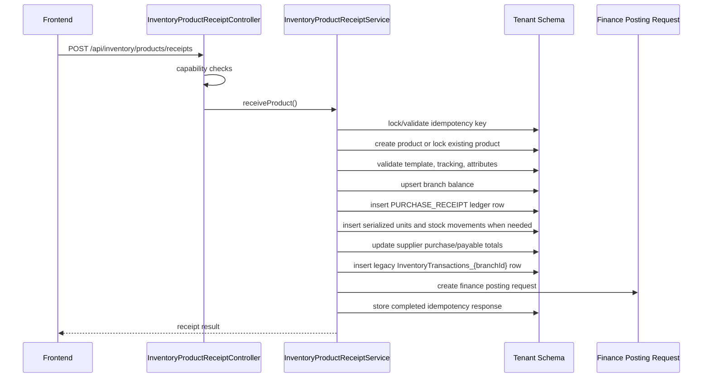

# Inventory Product Receipt P0 Hardening

## New Receipt Flow

`POST /api/inventory/products/receipts` is the authoritative write path for manual product receipt operations. It supports:

- `CREATE_PRODUCT_AND_RECEIVE`
- `RECEIVE_EXISTING_PRODUCT`

The endpoint coordinates product master creation, branch balance, ledger, serialized units, supplier totals, legacy transaction compatibility, finance posting request creation, and idempotency in one backend command.

## Transaction Boundary

`InventoryProductReceiptService.receiveProduct()` is annotated with `@Transactional`. If any step fails, product creation, balance change, ledger row, serialized units, supplier totals, legacy transaction row, finance posting request, and idempotency completion roll back together.

The old `products/{companyId}/{branchId}/saveProduct` and `invTrans/AddTransaction` endpoints remain available for compatibility, but the product-add UI now uses the receipt endpoint for new product receipts and existing-product stock-in.

## Idempotency

Migration `V110__inventory_product_receipt_idempotency.sql` creates tenant-scoped `inventory_operation_idempotency`.

Rules:

- Unique key: `company_id, branch_id, operation_type, idempotency_key`.
- Same key and same request hash returns the original completed response with `idempotentReplay = true`.
- Same key and different request hash returns `409 IDEMPOTENCY_KEY_PAYLOAD_CONFLICT`.
- Failed commands roll back the pending idempotency row, so retry is safe.

## Backward Compatibility

The new flow still inserts one legacy `InventoryTransactions_{branchId}` row so current history, supplier, and finance read paths continue to work. The authoritative inventory movement is the single `inventory_stock_ledger` row with `movement_type = PURCHASE_RECEIPT` and `reference_type = PRODUCT_RECEIPT`.

## Rollout Notes

- Existing split-write endpoints should be treated as deprecated for manual receipts.
- Frontend retry must reuse the same idempotency key until a final success response.
- Future work should make legacy endpoints delegate to `InventoryProductReceiptService` where behavior is equivalent.

## Known Assumptions

- The current backend requires `companyId` in the receipt request to resolve tenant schema and authorization context.
- Category validation remains compatible with branch JSON categories; relational category IDs are accepted but not yet authoritative.
- Finance posting uses the existing finance posting-request table as the outbox-style durable queue.
